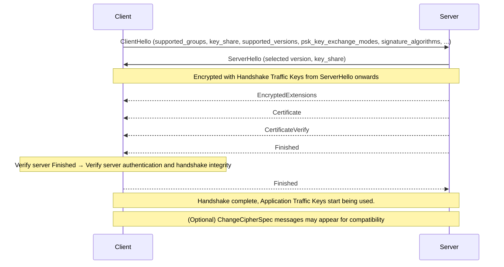

# Custom TLS

## Create a RSA-key certificate

Create a TLS certificate for your domain using [certbot][certbot] and its official [Docker image][certbot-docker].

```bash
docker run -it --rm \
  -v ${pwd}/certbot/etc/letsencrypt:/etc/letsencrypt \
  -v ${pwd}/certbot/var/lib/letsencrypt:/var/lib/letsencrypt \
  certbot/certbot certonly --manual \
  --preferred-challenges dns \
  --key-type rsa \
  --email your-email@email.com \
  --domain '*.your-domain.com' \
  --server https://acme-v02.api.letsencrypt.org/directory \
  --agree-tos
```

You can find sample certificate files in the `cert/example` directory, sourced from [AcornPublishing/tls-cryptography][book].

## View the contents of the certificate

```bash
# Show the public key chain details
openssl x509 -in fullchain1.pem -text
keytool -printcert -v -file fullchain1.pem

# Show the private key details
openssl rsa -in privkey1.pem -text
```

## Run tests

Use the following commands to configure, build, and test:

```bash
cmake --preset default
cmake --build build
ctest --preset default
```

## TLS 1.3 Handshake




[book]: https://github.com/AcornPublishing/tls-cryptography
[certbot]: https://github.com/certbot/certbot
[certbot-docker]: https://hub.docker.com/r/certbot/certbot
